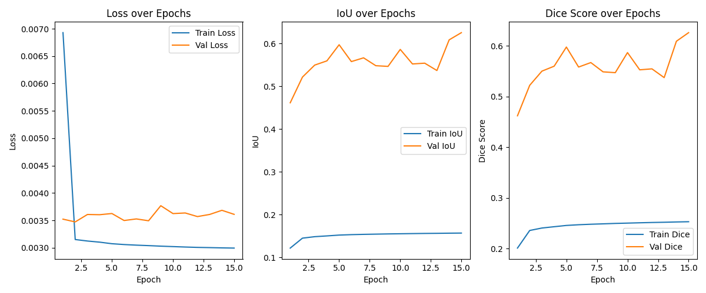

# KVALD - Kalman Vision-based Automated Local Dimming
I'll use python to prototype the code and C++ for the final production version.

I want to write a general overview of my current plans for the project.

## Overview
KVALD is a real time system for detecting and dimming high-intensity reigons in a video stream (e.g., bright headlights at night). It uses a lightweight neural network to generate a dynamic brightness mask, applies a differentiable Kalman-based smoothing filter, and outputs a control mask for localized dimming hardware.

## Building

To build the C++ code, you will need to have CMake and a C++ compiler installed. You will also need to have the LibTorch library installed.

Once you have the dependencies installed, you can build the code by running the following commands from the `build` directory:

```bash
cmake -DTorch_DIR=<path_to_libtorch> ..
cmake --build .
```

**Note:** You may need to replace `<path_to_libtorch>` with the actual path to your LibTorch installation. If you are still having issues, you may need to set the `CMAKE_MODULE_PATH` or `CMAKE_PREFIX_PATH` variables instead. Please refer to the CMake documentation for more information.

## Current Features:
None

## Planned Features:
- **Dynamic Input**: Supports USB cameras, network streams, and video files via OpenCV/GStreamer.
- **Neural Mask Generation**: MobileNet-backed U-Net produces a per-pixel [0,1] dimming mask.
- **Differentiable Kalman Filter**: Embedded as a trainable module for temporal consistency.
- **Spatial & Temporal Smoothing**: Bilateral/Gaussian blur plus EMA to reduce flicker.
- **Feedback Verification**: Optional light-weight verifier network to ensure consistency post-smoothing.
- **Efficient Inference**: Exportable to ONNX/TensorRT or libtorch C++ for sub-33ms latency.
- **Benchmarking Suite**: Automated latency and accuracy tests in `/benchmarks`.

## Repository Structure:
/
├─ src/                   # C++ inference & I/O code
├─ prototypes/            # Python training & prototyping scripts
│   ├─ proof_of_concept.py # Full proof of concept script
│   ├─ train.py            # Training script for neural mask generation
│   ├─ notebooks/            # Jupyter notebooks for visualization
│   └─ ...                # Other prototyping scripts
├─ include/               # Public headers
├─ models/                # Trained network weights (.pt, .onnx)
├─ data/                  # Sample videos & test inputs
├─ benchmarks/            # Performance test harnesses
├─ docs/
│   ├─ ARCHITECTURE.md    # System design and data flow
│   └─ ...                # Additional docs
├─ scripts/               # Data generation & utility scripts
├─ tests/                 # Unit & integration tests
├─ CMakeLists.txt         # Build configuration
├─ Dockerfile             # Reproducible dev environment <- do i need this?
├─ README.md              # This file
├─ LICENSE                # None yet, may add in the future
└─ .github/               # Again, none yet, may add in the future

## Training Progress
